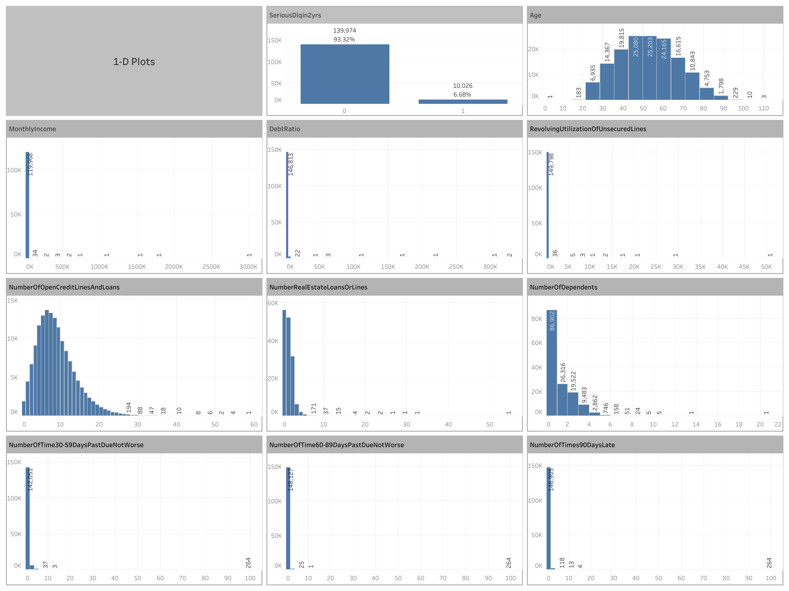
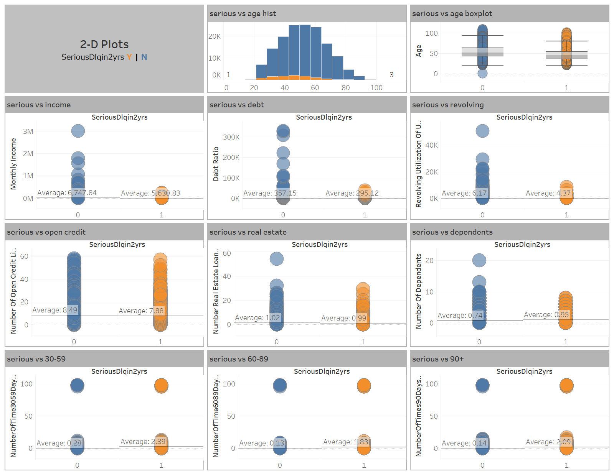
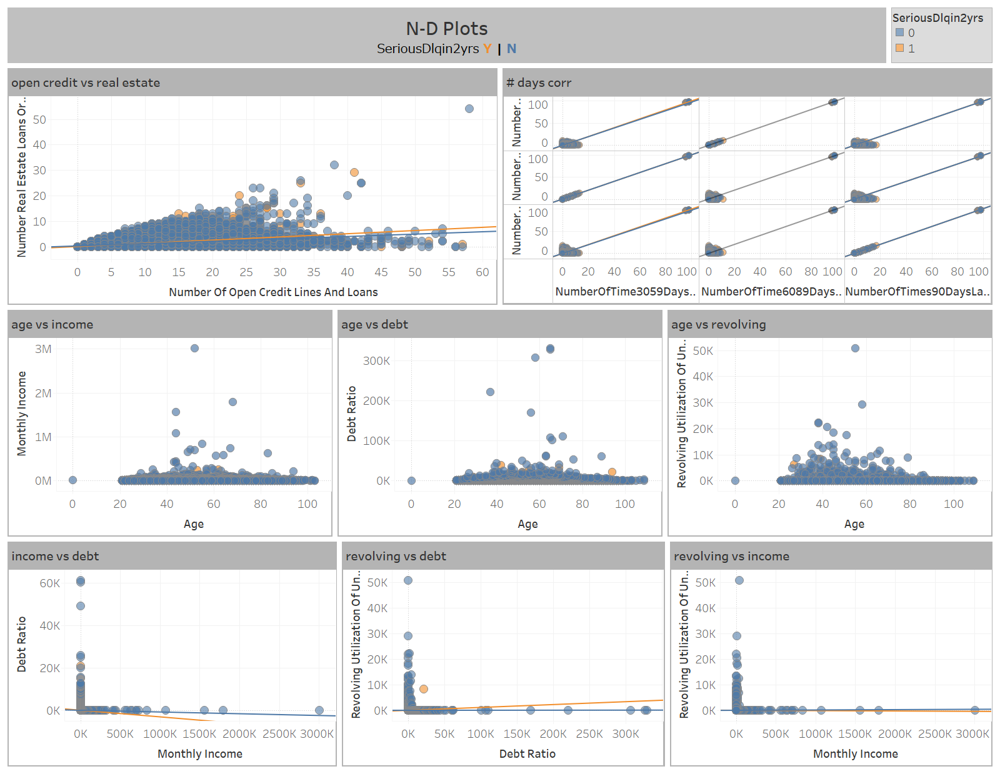

# Solution to the DSE Assignment

The solution to the assignment is as followed.

* Build the environment for the PoC [docker-compose.yml](docker-compose.yml) in docker (python and mysql).
* Create data structure in 'sample_data' table in 'dse-interview' database [create_table.py](python/create_table.py) in the created mysql server.
* Insert data from the provided csv file [sample_data.csv](python/sample_data.csv) to the 'sample_data' table [insert_data.py](python/insert_data.py).
* Access data and save a local copy of data in mysql server [read_data.py](python/read_data.py). 
* Create some stats [loading-and-stats.ipynb](python/loading-and-stats.ipynb) and visualizations [plot-from-mysqlserver.ipynb](python/plot-from-mysqlserver.ipynb) in Jupyter-Notebook from saved local file or directly accessed from server.
* Created lots of visualizations using Tableau with connecting to the mysql server directly and the visualizations are following [Give Me Some Credit - Visualizations](https://public.tableau.com/app/profile/ying.wang2930/viz/GiveMeSomeCredit-Visualizations/NDplots) . And here also has a local Tableau workbook [Visualizations.twbx](Visualizations.twbx) .






# Instruction and Issue Memo

## 1. download from gitlab
```
git clone https://gitlab.com/Kate_L/dse-interview.git
```

## 2. build and run with compose
```
$ docker compose up --build -d
```

## 3. run a command in 'python3' container
```
$ docker compose exec python3 bash
```

### 3-1. create table=sample_data in database=dse-interview
```
$ python3 create_table.py
```
### 3-2. insert data from csv to mysql server 
```
$ python3 insert_data.py
```
### 3-3. read data from mysql server and save a local file
```
$ python3 read_data.py
```
### 3-4. read data from mysql server in Tableau
```127.0.0.1:6603```


### python library
```
$ python -m pip install numpy
$ python -m pip install pandas
$ python -m pip install matplotlib
```

## 4. run a command in 'mysql_db' container
```
$ docker compose exec mysql_db bash
mysql -u root -p
password
```
### Got a package bigger than
```
SET GLOBAL max_allowed_packet=1000000000;
```

### show number of rows and columns in table
```
SELECT COUNT(*) AS num_rows FROM sample_data;
SELECT COUNT(*) AS num_columns FROM INFORMATION_SCHEMA.COLUMNS WHERE TABLE_SCHEMA = 'dse-interview' AND TABLE_NAME = 'sample_data';
```

## 5. hostname
```
hostname -i
```